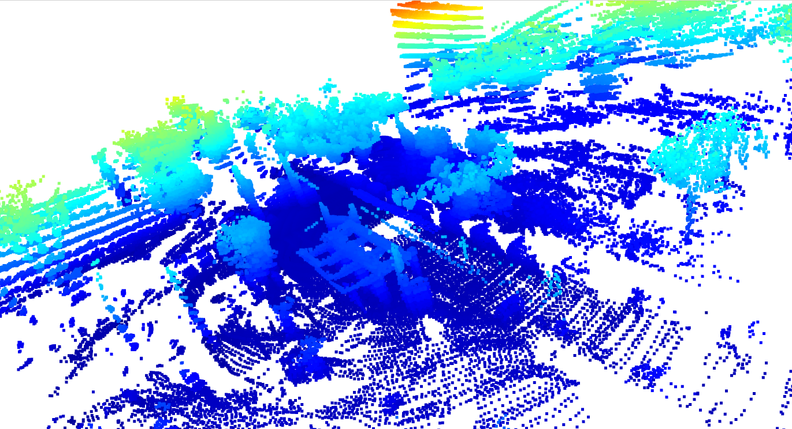

# LiDAR SLAM 

Implementação de um pipeline completo de SLAM (Simultaneous Localization 
and Mapping) com LiDAR, construída do zero em Python. O objetivo do projeto foi aprender os fundamentos reais de SLAM 
implementando cada componente a partir dos algoritmos originais.

Os arquivos .pcd utilizados vieram de um Lidar modelo Velodyne VLP-16





## O que foi implementado

- **ICP (Iterative Closest Point)** — registro entre nuvens de pontos com 
  solução fechada via SVD, incluindo correção de reflexão SO(3)
- **Odometria LiDAR** — estimativa de pose frame a frame com acumulação 
  de transformações SE(3)
- **Scan Context** — descritor 2D compacto para representação de scans, 
  com busca invariante à rotação
- **Loop Closure** — detecção de revisita usando similaridade cosseno 
  entre descritores Scan Context
- **Pose Graph Optimization** — correção global do drift com g2o 
  (Levenberg-Marquardt sobre SE3)
- **Mapa global** — reconstrução da nuvem de pontos acumulada com as 
  poses otimizadas

---

## Estrutura do projeto
```
LidarView_SLAM/
├── slam/
│   ├── preprocessing.py      # Voxel downsampling e remoção de outliers
│   ├── registration.py       # ICP e funções auxiliares (SVD, correspondências)
│   ├── loop_closure.py       # Scan Context e LoopClosureDetector
│   ├── graph_optimization.py # Pose graph com g2o
│   └── mapping.py            # Pipeline principal (build_map)
├── main.py                 
├── requirements.txt
└── README.md
```

---

## Como usar

**1. Instalar dependências**
```
pip install -r requirements.txt
```

**2. Colocar seus arquivos `.pcd` numa pasta**

Os arquivos devem estar em ordem numérica — o pipeline os processa sequencialmente.
Substitua no main.py: "./data_raw_lidar/", pelo caminho da pasta onde seus arquivos .pcd estão localizados.

**3. Rodar**
```
python3 main.py
```

---

## Parâmetros

| Parâmetro | Padrão | Quando ajustar |
|---|---|---|
| `voxel_size` | 0.3m | Diminuir para cenas densas/indoor, aumentar para sequências longas |
| `max_range` | 80.0m | Reduzir para LiDAR indoor (ex: 10-20m) |
| `threshold` (loop closure) | 0.11 | Aumentar se nenhum loop for detectado, diminuir se houver falsos positivos |

---

## Requisitos

- Python 3.8+
- LiDAR outdoor com arquivos `.pcd` sequenciais
- Os parâmetros foram calibrados para LiDAR de longo alcance (~200m). 
  Para sensores indoor, ajuste `max_range` e `voxel_size`.

---

## Referências

- Besl & McKay (1992) — *A Method for Registration of 3-D Shapes*
- Zhang & Singh (2014) — *LOAM: Lidar Odometry and Mapping in Real-time*
- Kim & Kim (2018) — *Scan Context: Egocentric Spatial Descriptor for 
  Place Recognition*
- Grisetti et al. (2010) — *A Tutorial on Graph-Based SLAM*
